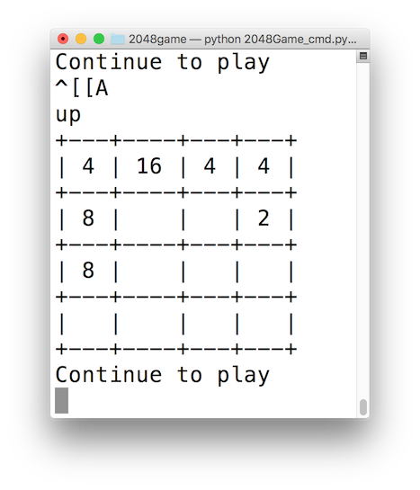
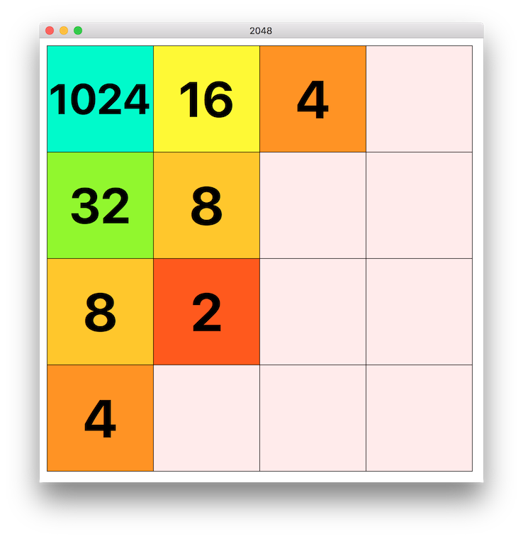
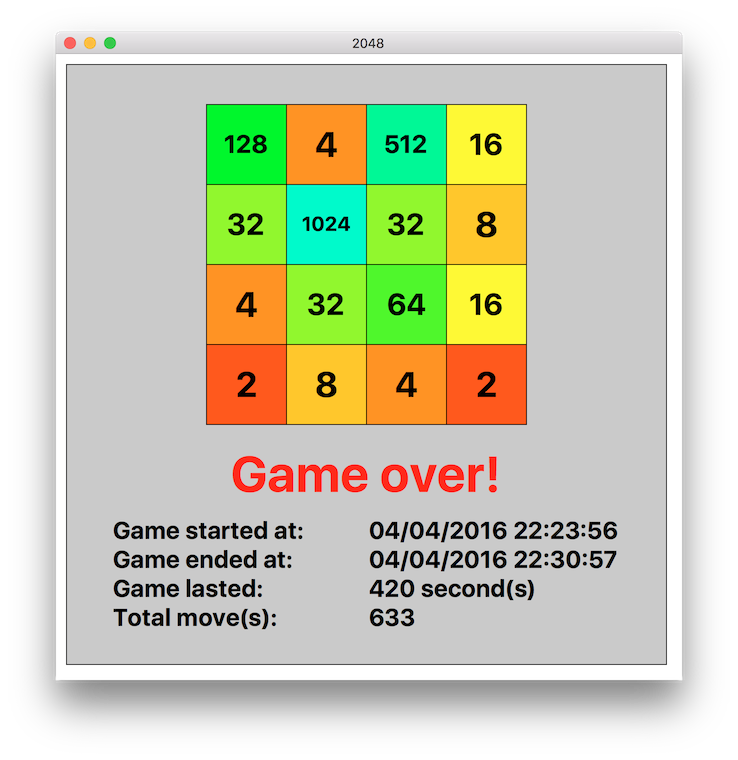

#2048
- Python version of the famous 2048 game
- GUI built using Tkinter library
- Command line window version available as well
- Game ended with summary and data saved to external files

##How to play
- Download and install python 2.7 from [here](https://www.python.org/download/releases/2.7/)
- Click Download ZIP and extract it
- Run `python 2048Game_cmd.py` (command line window) or `python 2048Game_tk` (GUI using Tkinter) to start game
- Press <kbd>&uarr;</kbd>, <kbd>&darr;</kbd>, <kbd>&larr;</kbd>, <kbd>&rarr;</kbd> to play

##Screenshots
Command line window version

Tkinter GUI (in progress)

Tkinter GUI (game over)

